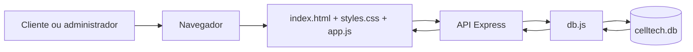
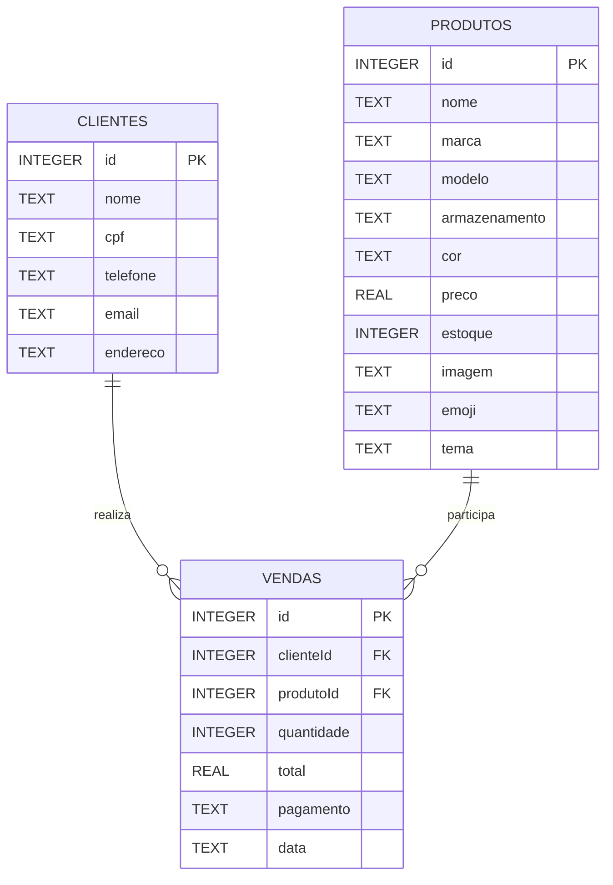

# PROJETO INTEGRADOR DE DESENVOLVIMENTO DE SISTEMAS

## CellTech — Sistema web para venda e gerenciamento de celulares

**Instituição:** __________________________________________  
**Curso:** ________________________________________________  
**Disciplina:** Projeto Integrador de Desenvolvimento de Sistemas  
**Aluno(s):** _____________________________________________  
**Professor(a):** __________________________________________  
**Cidade:** _______________________________________________  
**Ano:** 2026

---

## Resumo

Este projeto apresenta o desenvolvimento do **CellTech**, um sistema web destinado a uma loja de celulares. A aplicação reúne uma vitrine online para clientes e um painel administrativo para gerenciamento de produtos, clientes, vendas, estoque e relatórios. O sistema foi desenvolvido com HTML, CSS e JavaScript no frontend, Node.js e Express no backend e SQLite para persistência dos dados.

A solução foi planejada para ser simples, responsiva e adequada ao contexto de uma pequena loja, permitindo que o usuário consulte produtos, monte um carrinho e finalize um pedido demonstrativo. No ambiente administrativo, é possível cadastrar e pesquisar celulares e clientes, registrar vendas, controlar entradas e saídas de estoque e acompanhar indicadores do negócio. A arquitetura também foi organizada para facilitar a compreensão por estudantes iniciantes e permitir futuras evoluções, como autenticação real, pagamentos online e separação das rotas por recurso.

**Palavras-chave:** sistema web; loja de celulares; estoque; vendas; SQLite; JavaScript.

---

## 1. Introdução

A transformação digital modificou a forma como os consumidores pesquisam e compram produtos. Mesmo lojas de pequeno porte precisam organizar informações de clientes, produtos, vendas e estoque para oferecer um atendimento mais rápido e reduzir erros operacionais.

Em uma loja de celulares, essa necessidade é ainda maior porque os produtos possuem diversas características, como marca, modelo, armazenamento, cor e preço. Quando esses dados são controlados somente em anotações ou planilhas desconectadas, podem ocorrer problemas como venda de produtos sem estoque, dificuldade para localizar informações, ausência de histórico de vendas e falta de indicadores para apoiar decisões.

O **CellTech** foi desenvolvido para responder a esse problema. O sistema concentra a operação da loja em uma única aplicação web, conectando a experiência de compra do cliente ao controle interno da empresa.

---

## 2. Caracterização do problema

A loja fictícia CellTech necessita de uma solução que permita:

- apresentar seus celulares aos clientes de forma organizada;
- registrar produtos e suas características;
- cadastrar e consultar clientes;
- registrar vendas com cálculo automático do valor total;
- atualizar o estoque após cada venda;
- controlar entradas e saídas de produtos;
- acompanhar produtos com quantidade reduzida;
- consultar relatórios básicos da operação.

Sem um sistema integrado, a equipe pode depender de controles manuais, ocasionando retrabalho, informações desatualizadas e dificuldade para acompanhar o desempenho da loja.

### 2.1 Pergunta norteadora

Como desenvolver um sistema web simples, responsivo e de baixo custo que integre a vitrine de uma loja de celulares ao gerenciamento de produtos, clientes, vendas e estoque?

---

## 3. Justificativa

O desenvolvimento do CellTech é relevante por três motivos principais.

**Relevância prática:** a aplicação representa uma situação comum no comércio e demonstra como um sistema pode organizar processos de uma pequena empresa.

**Relevância acadêmica:** o projeto reúne conhecimentos de levantamento de requisitos, prototipação de interfaces, desenvolvimento frontend, backend, banco de dados, testes e documentação.

**Relevância social e profissional:** a solução utiliza tecnologias acessíveis e uma estrutura que pode ser compreendida por estudantes iniciantes, servindo como base para projetos reais mais completos.

A escolha do SQLite também é adequada ao projeto porque permite trabalhar com um banco de dados real sem exigir a instalação de um servidor de banco separado. O arquivo `celltech.db` pode ser levado junto com o projeto e utilizado localmente durante a apresentação.

---

## 4. Objetivos

### 4.1 Objetivo geral

Desenvolver um sistema web chamado **CellTech** para apoiar a venda e o gerenciamento de celulares, integrando uma loja online demonstrativa a um painel administrativo com controle de produtos, clientes, vendas e estoque.

### 4.2 Objetivos específicos

- Criar uma interface moderna, simples e responsiva.
- Desenvolver uma vitrine online com busca de produtos.
- Implementar um carrinho de compras demonstrativo.
- Permitir o cadastro, a edição, a pesquisa e a exclusão de produtos.
- Permitir o cadastro, a edição, a pesquisa e a exclusão de clientes.
- Registrar vendas com cálculo automático do valor total.
- Atualizar automaticamente o estoque após uma venda.
- Permitir movimentações de entrada e saída de produtos.
- Exibir alertas para produtos com estoque baixo.
- Criar relatórios básicos para apoiar a análise da loja.
- Persistir os dados em um banco SQLite por meio de uma API Express.
- Organizar o código para facilitar sua apresentação e manutenção.

---

## 5. Escopo do sistema

### 5.1 Funcionalidades incluídas

#### Loja online

- Banner de apresentação da CellTech.
- Catálogo de celulares disponíveis.
- Busca por nome, marca ou modelo.
- Exibição de preço, marca, armazenamento e cor.
- Inclusão de produtos no carrinho.
- Controle da quantidade de itens.
- Cálculo do total do pedido.
- Verificação da disponibilidade em estoque.
- Finalização de pedido demonstrativa.

#### Painel administrativo

- Tela de login demonstrativa.
- Dashboard com indicadores da loja.
- Cadastro e gerenciamento de produtos.
- Cadastro e gerenciamento de clientes.
- Registro e histórico de vendas.
- Controle de estoque.
- Relatórios de vendas e produtos mais vendidos.

#### Banco de dados

- Tabela `produtos`.
- Tabela `clientes`.
- Tabela `vendas`.
- Chaves estrangeiras entre vendas, clientes e produtos.
- Seed automático com dados de demonstração.

### 5.2 Limitações do protótipo

Para manter o projeto adequado ao escopo acadêmico, alguns recursos não foram implementados:

- O login é demonstrativo e ainda não possui autenticação real.
- O pagamento online não é processado por uma operadora real.
- A finalização da compra não possui integração com transportadora.
- A exportação de relatórios é representada por uma ação demonstrativa.
- Não existe ainda um cadastro de usuários com diferentes níveis de permissão.

Essas limitações são oportunidades de evolução e não impedem a demonstração do funcionamento principal do sistema.

---

## 6. Requisitos do sistema

### 6.1 Requisitos funcionais

| Código | Requisito |
|---|---|
| RF01 | O sistema deve permitir o acesso à tela de login. |
| RF02 | O sistema deve apresentar a loja online com os produtos disponíveis. |
| RF03 | O sistema deve permitir pesquisar celulares por nome, marca ou modelo. |
| RF04 | O sistema deve permitir adicionar produtos ao carrinho. |
| RF05 | O sistema deve calcular o total do carrinho automaticamente. |
| RF06 | O sistema deve impedir a seleção de quantidade superior ao estoque disponível. |
| RF07 | O administrador deve cadastrar, editar, excluir e pesquisar produtos. |
| RF08 | O administrador deve cadastrar, editar, excluir e pesquisar clientes. |
| RF09 | O administrador deve registrar vendas com cliente, produto, quantidade e pagamento. |
| RF10 | O sistema deve calcular o valor total de uma venda. |
| RF11 | O sistema deve atualizar o estoque após uma venda. |
| RF12 | O sistema deve permitir registrar entrada e saída de produtos. |
| RF13 | O sistema deve destacar produtos com estoque baixo. |
| RF14 | O sistema deve exibir o histórico de vendas. |
| RF15 | O sistema deve exibir relatórios básicos da operação. |
| RF16 | O sistema deve persistir os dados no banco SQLite por meio da API. |

### 6.2 Requisitos não funcionais

| Código | Requisito |
|---|---|
| RNF01 | A interface deve ser responsiva para computador, tablet e celular. |
| RNF02 | O sistema deve utilizar HTML, CSS e JavaScript no frontend. |
| RNF03 | O backend deve utilizar Node.js e Express. |
| RNF04 | O banco de dados deve ser SQLite. |
| RNF05 | O código deve possuir nomes de variáveis e funções compreensíveis. |
| RNF06 | A aplicação deve ser executável localmente pelo VS Code. |
| RNF07 | A interface deve utilizar uma identidade visual tecnológica, com preto, branco e dourado. |
| RNF08 | Os dados devem ser mantidos mesmo após o encerramento do servidor. |

---

## 7. Metodologia

O projeto foi desenvolvido com uma abordagem incremental. Primeiro foram identificadas as necessidades da loja e definidas as funcionalidades principais. Em seguida, foi criada a estrutura visual do sistema e, depois, foram adicionadas as regras de negócio e a persistência dos dados.

As etapas foram:

1. **Levantamento de requisitos:** identificação das funções necessárias para loja, painel, vendas e estoque.
2. **Definição da interface:** escolha de cores, tipografia, menu lateral, cards, tabelas e layout responsivo.
3. **Prototipação frontend:** criação das telas com HTML e CSS.
4. **Implementação das interações:** criação de eventos, formulários, filtros, carrinho e regras de estoque em JavaScript.
5. **Implementação do backend:** criação do servidor Express e das rotas da API.
6. **Modelagem do banco:** criação das tabelas SQLite e dos relacionamentos básicos.
7. **Integração:** conexão do frontend com as rotas `/api/state`.
8. **Testes:** validação da sintaxe, rotas, leitura, gravação e acesso à interface.
9. **Documentação:** elaboração do README e deste relatório.

---

## 8. Tecnologias utilizadas

### HTML5

Utilizado para estruturar as páginas, formulários, navegação, tabelas, modais e componentes da loja.

### CSS3

Utilizado para criar o tema visual, o menu lateral, os cards, os estados de estoque, a responsividade e os componentes da vitrine.

### JavaScript

Responsável pela navegação entre seções, abertura de modais, cálculos, filtros, carrinho, controle de estoque, comunicação com a API e atualização da interface.

### Node.js

Ambiente de execução utilizado no backend.

### Express

Framework responsável pela criação do servidor web e das rotas da API.

### SQLite

Banco de dados relacional utilizado para armazenar produtos, clientes e vendas em um arquivo local.

### better-sqlite3

Biblioteca Node.js utilizada para realizar a comunicação entre o backend e o banco SQLite.

---

## 9. Arquitetura da solução

O CellTech utiliza uma arquitetura simples de três camadas:

1. **Camada de apresentação:** HTML, CSS e JavaScript executados no navegador.
2. **Camada de aplicação:** servidor Node.js com Express e regras de comunicação.
3. **Camada de dados:** banco SQLite armazenado no arquivo `celltech.db`.



### 9.1 Fluxo de uma venda

1. O usuário escolhe um cliente e um celular.
2. O sistema recebe a quantidade desejada.
3. O JavaScript calcula o total com base no preço unitário.
4. O sistema verifica se há estoque suficiente.
5. O estoque é reduzido.
6. A venda é adicionada ao histórico.
7. O estado atualizado é enviado para `POST /api/state`.
8. O backend grava os dados no SQLite.

---

## 10. Modelagem do banco de dados

### 10.1 Tabela produtos

| Campo | Tipo | Descrição |
|---|---|---|
| `id` | INTEGER | Identificador único do produto. |
| `nome` | TEXT | Nome comercial do celular. |
| `marca` | TEXT | Fabricante do aparelho. |
| `modelo` | TEXT | Código ou modelo do aparelho. |
| `armazenamento` | TEXT | Capacidade de armazenamento. |
| `cor` | TEXT | Cor do produto. |
| `preco` | REAL | Preço de venda. |
| `estoque` | INTEGER | Quantidade disponível. |
| `imagem` | TEXT | URL opcional da imagem. |
| `tema` | TEXT | Tema visual do card do produto. |

### 10.2 Tabela clientes

| Campo | Tipo | Descrição |
|---|---|---|
| `id` | INTEGER | Identificador único do cliente. |
| `nome` | TEXT | Nome completo. |
| `cpf` | TEXT | Documento do cliente. |
| `telefone` | TEXT | Telefone de contato. |
| `email` | TEXT | E-mail do cliente. |
| `endereco` | TEXT | Endereço ou cidade do cliente. |

### 10.3 Tabela vendas

| Campo | Tipo | Descrição |
|---|---|---|
| `id` | INTEGER | Identificador único da venda. |
| `clienteId` | INTEGER | Referência ao cliente. |
| `produtoId` | INTEGER | Referência ao produto. |
| `quantidade` | INTEGER | Quantidade vendida. |
| `total` | REAL | Valor total da venda. |
| `pagamento` | TEXT | Forma de pagamento. |
| `data` | TEXT | Data e hora da venda. |

As colunas `clienteId` e `produtoId` funcionam como referências para relacionar a venda aos registros correspondentes.

### 10.4 Diagrama entidade-relacionamento

O diagrama abaixo representa as tabelas principais do banco e seus relacionamentos. Um cliente pode realizar várias vendas e um produto pode aparecer em várias vendas.



O arquivo editável desse diagrama está disponível em `diagrama-banco.mmd`.

---

## 11. Estrutura de pastas

```text
CellTech/
├── index.html          # Interface principal e login
├── css/
│   └── styles.css      # Tema visual e responsividade
├── js/
│   └── app.js          # Regras do frontend e integração com API
├── server.js           # Servidor Express
├── db.js               # Banco, tabelas, seed e persistência
├── package.json        # Dependências e scripts
├── package-lock.json   # Versões instaladas
├── celltech.db         # Banco local criado na execução
├── assets/             # Espaço para imagens
└── README.md           # Guia de instalação e execução
```

---

## 12. Descrição das telas

### 12.1 Tela de login

A tela apresenta a identidade visual da CellTech, campos de usuário/e-mail e senha, botão de entrada e uma mensagem explicando que se trata de uma demonstração acadêmica.

### 12.2 Loja online

A vitrine apresenta um banner, catálogo de produtos, campo de busca e botão de carrinho. Cada card mostra o celular, suas características, o preço e a opção de adicionar ao carrinho.

### 12.3 Dashboard

O dashboard mostra indicadores resumidos da operação, como quantidade de produtos, clientes, vendas e faturamento. Também apresenta um gráfico ilustrativo, alertas de estoque baixo e vendas recentes.

### 12.4 Produtos

A tela permite visualizar os celulares em cards, pesquisar por nome, marca ou modelo e abrir formulários para cadastrar, editar ou excluir itens.

### 12.5 Clientes

A tela apresenta os clientes em uma tabela organizada e oferece ações para cadastro, edição, exclusão e pesquisa.

### 12.6 Vendas

A tela permite registrar vendas manualmente, selecionar cliente, produto, quantidade e forma de pagamento. O total é calculado automaticamente.

### 12.7 Estoque

A tela apresenta a quantidade disponível de cada produto e identifica os itens com estoque baixo. Também permite realizar entradas e saídas.

### 12.8 Relatórios

A área de relatórios apresenta produtos mais vendidos, total vendido e valor estimado do inventário atual.

---

## 13. Testes realizados

| Teste | Procedimento | Resultado esperado | Resultado obtido |
|---|---|---|---|
| T01 | Executar `npm install`. | Instalar dependências. | Aprovado. |
| T02 | Executar `npm start`. | Iniciar o servidor na porta 3000. | Aprovado. |
| T03 | Acessar `/api/health`. | Retornar status do projeto e do banco. | Aprovado. |
| T04 | Acessar `/api/state`. | Retornar produtos, clientes e vendas. | Aprovado. |
| T05 | Abrir a página inicial. | Carregar a interface CellTech. | Aprovado. |
| T06 | Adicionar item ao carrinho. | Atualizar quantidade do carrinho. | Aprovado. |
| T07 | Finalizar pedido demonstrativo. | Registrar venda e reduzir estoque. | Aprovado. |
| T08 | Cadastrar produto. | Exibir o produto no catálogo. | Aprovado. |
| T09 | Cadastrar cliente. | Exibir o cliente na tabela. | Aprovado. |
| T10 | Registrar entrada de estoque. | Aumentar a quantidade disponível. | Aprovado. |
| T11 | Registrar saída maior que o estoque. | Impedir a operação e exibir aviso. | Aprovado. |
| T12 | Redimensionar a janela. | Adaptar o layout para telas menores. | Aprovado. |
| T13 | Salvar o estado atualizado. | Persistir dados no arquivo SQLite. | Aprovado. |

Também foram realizadas verificações de sintaxe com `node --check js/app.js` e validação do arquivo `manus-routes.json` como JSON válido.

---

## 14. Resultados alcançados

O projeto alcançou os principais objetivos propostos. Foi criada uma aplicação capaz de representar tanto a experiência de compra de um cliente quanto a rotina administrativa de uma loja de celulares.

A integração entre loja, vendas e estoque é o principal resultado do sistema. Quando um pedido é finalizado, a venda é registrada e a quantidade do produto é reduzida. Dessa forma, o sistema demonstra uma regra de negócio importante: a disponibilidade exibida ao cliente deve estar relacionada ao estoque controlado pela loja.

O uso do SQLite também permitiu ultrapassar o conceito de uma interface estática. Os dados agora podem ser persistidos e recuperados pelo backend, mantendo a solução simples o suficiente para ser apresentada e explicada em sala de aula.

---

## 15. Segurança e melhorias futuras

Embora o protótipo atenda ao objetivo acadêmico, uma versão de produção deveria receber melhorias importantes:

- Implementar autenticação real com senha criptografada.
- Criar usuários com permissões diferentes, como administrador e vendedor.
- Validar CPF, e-mail, preços e quantidades no backend.
- Separar as rotas em `/api/produtos`, `/api/clientes`, `/api/vendas` e `/api/estoque`.
- Utilizar transações específicas para registrar vendas e atualizar estoque.
- Criar uma tabela de movimentações de estoque.
- Integrar um gateway de pagamento real.
- Adicionar upload e armazenamento de imagens dos produtos.
- Implementar exportação de relatórios em PDF ou CSV.
- Criar backups automáticos do banco de dados.
- Utilizar variáveis de ambiente para configurações do servidor.
- Aplicar validação e proteção contra ataques comuns em uma implantação pública.

---

## 16. Conclusão

O desenvolvimento do CellTech demonstrou como os conhecimentos de desenvolvimento de sistemas podem ser aplicados na criação de uma solução completa para uma necessidade comercial. O projeto integrou frontend, backend e banco de dados em uma aplicação única, com foco em clareza, simplicidade e facilidade de manutenção.

A vitrine online atende ao processo de consulta e pedido de produtos, enquanto o painel administrativo organiza os dados necessários para a operação da loja. O controle automático de estoque após a venda reduz a possibilidade de inconsistências e mostra a importância da integração entre os módulos de um sistema.

Como resultado, o CellTech representa uma base funcional para uma loja de celulares e também um projeto didático que pode ser explicado por estudantes iniciantes. A aplicação pode evoluir com autenticação real, pagamentos, relatórios avançados, novas tabelas e publicação em ambiente de produção.

---

## Referências

- EXPRESS. **Express — Node.js web application framework**. Documentação oficial. Disponível em: <https://expressjs.com/>. Acesso em: 2026.
- MDN WEB DOCS. **HTML, CSS e JavaScript**. Documentação para desenvolvimento web. Disponível em: <https://developer.mozilla.org/pt-BR/>. Acesso em: 2026.
- NODE.JS. **Node.js Documentation**. Documentação oficial. Disponível em: <https://nodejs.org/docs/latest/api/>. Acesso em: 2026.
- SQLITE. **SQLite Documentation**. Documentação oficial. Disponível em: <https://www.sqlite.org/docs.html>. Acesso em: 2026.
- BETTER-SQLITE3. **better-sqlite3**. Documentação do pacote utilizado no projeto. Disponível em: <https://github.com/WiseLibs/better-sqlite3>. Acesso em: 2026.

---

## Apêndice A — Comandos para apresentação

```bash
# Entrar na pasta do projeto
cd CellTech

# Instalar dependências
npm install

# Iniciar o sistema
npm start
```

A aplicação ficará disponível em:

```text
http://localhost:3000
```

Credenciais demonstrativas:

```text
Usuário: admin
Senha: 1234
```

O login do protótipo aceita qualquer usuário e senha com pelo menos quatro caracteres.
